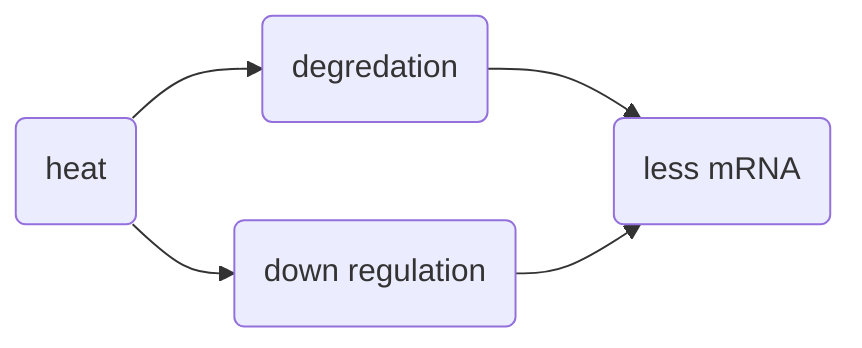
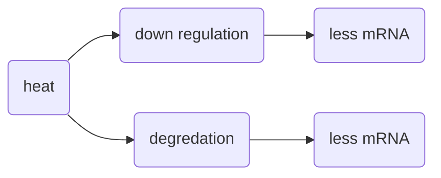

# Baseball :baseball:

Rules of baseball

1. Have fun :thumbsup:
2. No other rules :smile:
   - Except don't cheat like the Sox. Bad Red Sox!

Other sports

- the one with that flat round thing :ice_hockey:
- the one with the concussions :football:
- the one with the bouncing :basketball:
- the one with the grunting :tennis:
- the one with the small ball and the smaller hole :golf:
- the one where you knock things down :bowling:

## This is a smaller header

Now I am going to _try_ a manual line <br>

break. That was **fun**.

### This is an even smaller header

This is a link to my [website](https://tsoleary.github.io/).

#### This header is yet even smaller

This is just old regular text.

##### These headers are getting awful small

This is the start of a book:

> "It was the best of times, it was the worst of times..."

###### Almost not even a header anymore

```R
mean(my_data)
```

This is an inline block code `mean(my_data)`.

```{r calc_mean}
# this is an r code block
mean(stuff)
```

This is math in-line $E = mc^2$. This is a math block below.
$$
E = mc^2
$$

---

| Location | \# of :panda_face: | \# of :whale: |
| ------------ | :------------ | ------------ |
| :ocean: | 0 | 43250982 |
| :desert_island: | 0 | 0 |
| :bamboo: | 179340 | 0 |


---



I decided to change the flow chart a bit to get because it is really the same result.



But if I wanted it to look the same I could do this.

- WOW an italic emoji _:stuck_out_tongue:_ ! 
- This is a bold emoji **:whale:** 
- This is a regular emoji:whale:
- The bolding doesn't do anything :cry:


